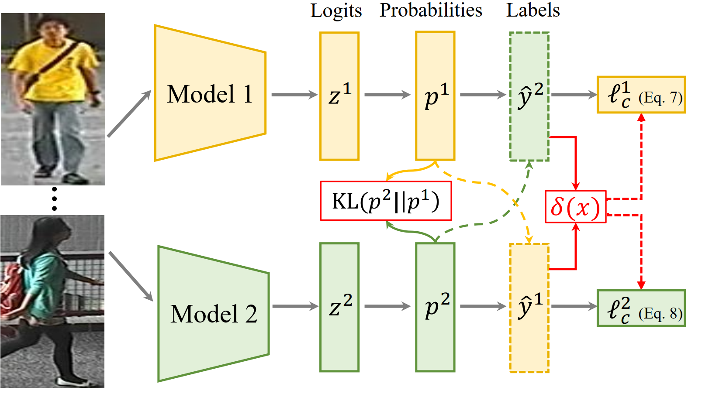

# ReID-Label-Noise

Demo Code for refining person re-identification model under label noise used in [1] and [2].

## Highlight

The goal of this work is to learn a robust Re-ID model against different noise types. We introduce an online co-refining (CORE) framework with dynamic mutual learning, where networks and label predictions are online optimized collaboratively by distilling the knowledge from other peer networks.




### 1. Prepare the Dataset

Note that the demo code use a re-oganized file structure so that the code can be seamlessly applied on three datasets, including Market1501, Duke-MTMC and CUHK03 datasets. The detailed description can be found in this [website](https://github.com/layumi/Person_reID_baseline_pytorch#dataset--preparation).

```
training/
   |--id 1/
      |--img 001001/
      |--img 001002/
   |--id 2/  
      |--img 002001/
      |--img 002002/

query/

gallery/
...                 
```

### 2. Running the Code.
  Train a model by
  ```bash
python train_core.py --dataset market --batchsize 32 --noise_ratio 0.2 --lr 0.01 --pattern
```

  - `--dataset`: which dataset "market" , "duke" or "cuhk03".

  - `--batchsize`: batch training size.

  - `--noise_ratio`: 0.2

  - `--lr`: initial learning rate.
  
  -  `--pattern`: "patterned noise" or "random noise".
  
  - `--gpu`:  which gpu to run.

You need mannully define the data path first.

**Parameters**: More parameters can be found in the script.

**Training Model**: The training models will be saved in `checkpoint/".


### 3. Citation

Please kindly cite this paper in your publications if it helps your research:
```
@article{tip21core,
  title={Collaborative Refining for Person Re-Identification with Label Noise},
  author={Ye, Mang and Li, He and Du, Bo and Shen, Jianbing and Shao, Ling and Hoi, Steven C. H.},
  journal={IEEE Transactions on Image Processing (TIP)},
  year={2021},
}

@article{tifs20noisy,
  title={PurifyNet: A Robust Person Re-identification Model with Noisy Labels},
  author={Ye, Mang and Yuen, Pong C.},
  journal={IEEE Transactions on Information Forensics and Security (TIFS)},
  volume={15},
  pages={2655--2666},
  year={2020},
}
```

###  4. References.

[1] M. Ye, H. Li, B. Du, J. Shen, L. Shao, and S. C., Hoi. 	Collaborative Refining for Person Re-Identification with Label Noise. IEEE Transactions on Image Processing (TIP), 2021.

[2] M. Ye and P. C. Yuen. PurifyNet: A Robust Person Re-identification Model with Noisy Labels. IEEE Transactions on Information Forensics and Security (TIFS), 2020.
